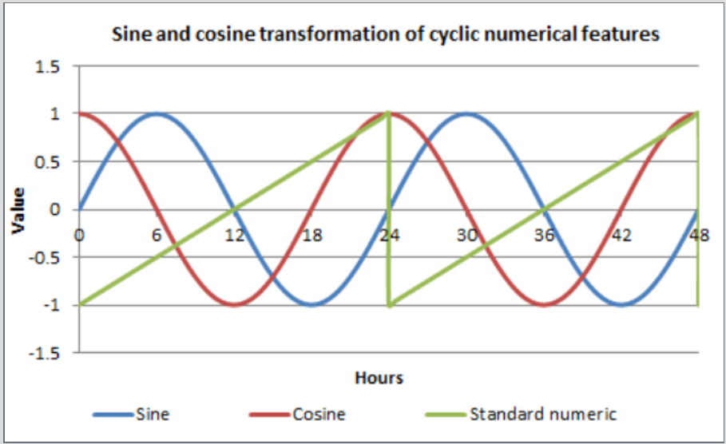

## [Overview](../index.md)

## [Data Exploration](../Data_exploration/exploration.md)

## [Preprocessing](../preprocessing/cleaning.md)

# Feature Extraction

## [Model Building](../model_building/model.md)

## [Conclusion](../conclusion/conclusion.md)

### Feature Creation and Analysis

In this section, we will bin the categories in the `payment_types` and `companies` features. Later we will perform feature extraction on the Timestamp variable as evident by EDA, time plays an important role while predicting the total fare amount.

Let's begin by loading the dataset from the Google BigQuery output in the previous section in R.

#### Loading Libraries
```R
library(dplyr)
library(data.table)
library(anytime)
library(lubridate)
```

#### Load data
```R
df= fread("hourly_data_2013-2016.csv")
head(df)
```
| hour | day | year | month | taxi_id | Number_rides | trip_start_timestamp    | trip_end_timestamp      | trip_seconds | trip_miles | trip_total | payment_types | companies | pickup_latitude | pickup_longitude | pickup_location                      | dropoff_latitude | dropoff_longitude | dropoff_location                     |
|------|-----|------|-------|---------|--------------|-------------------------|-------------------------|--------------|------------|------------|---------------|-----------|-----------------|------------------|--------------------------------------|------------------|-------------------|--------------------------------------|
| 0    | 1   | 2013 | 1     | 2c35ec  | 3            | 2013-01-01 00:45:00 UTC | 2013-01-01 00:45:00 UTC | 1380         | 6          | 27.15      | Cash          |           | 41.92268628     | -87.64220631     | POINT (-87.6422063127 41.9305785697) | 41.92904694      | -87.65131088      | POINT (-87.6513108767 41.9290469366) |
| 1    | 1   | 2013 | 1     | 89dea8  | 4            | 2013-01-01 01:15:00 UTC | 2013-01-01 01:30:00 UTC | 1980         | 8.7        | 40.6       | Cash          |           | 41.89250778     | -87.62621491     | POINT (-87.6262105324 41.8991556134) | 41.89915561      | -87.63171737      | POINT (-87.6262149064 41.8925077809) |
| 1    | 1   | 2013 | 1     | 6b2939  | 4            | 2013-01-01 01:00:00 UTC | 2013-01-01 01:15:00 UTC | 2760         | 7.7        | 40.6       | Cash          |           | 41.94906053     | -87.6616429      | POINT (-87.6612652184 41.936159071)  | 41.97256254      | -87.67208099      | POINT (-87.6612652184 41.936159071)  |
| 2    | 1   | 2013 | 1     | 4bf516  | 3            | 2013-01-01 02:00:00 UTC | 2013-01-01 02:45:00 UTC | 3600         | 8.3        | 39.75      | Cash          |           | 41.93615907     | -87.66126522     | POINT (-87.6612652184 41.936159071)  | 41.90749193      | -87.63576009      | POINT (-87.6357600901 41.9074919303) |
| 2    | 1   | 2013 | 1     | a23c6cf | 3            | 2013-01-01 02:15:00 UTC | 2013-01-01 02:30:00 UTC | 2280         | 12.5       | 39.75      | Cash          |           | 41.90749193     | -87.63576009     | POINT (-87.6357600901 41.9074919303) | 41.92268628      | -87.64948873      | POINT (-87.6494887289 41.9226862843) |
| 3    | 1   | 2013 | 1     | 33164e  | 3            | 2013-01-01 03:15:00 UTC | 2013-01-01 03:30:00 UTC | 2160         | 11.4       | 33.15      | Cash          |           | 41.90120699     | -87.6430228      | POINT (-87.6430228044 41.9345397158) | 41.9000696       | -87.69419737      | POINT (-87.6941973701 41.9005603836) |

Remove unwanted characters from the Timestamp. R does not automatically parse Timestamp. We need to convert it into Timestamp from String.

```R
df=df %>%
  mutate(trip_start_timestamp = substring(trip_start_timestamp,1, nchar(trip_start_timestamp)-4),
         trip_end_timestamp= substring(trip_end_timestamp, 1,nchar(trip_end_timestamp)-4))


df$trip_start_timestamp=  as.POSIXct(df$trip_end_timestamp,format="%Y-%m-%d %H:%M:%S")
df$trip_end_timestamp=  as.POSIXct(df$trip_end_timestamp,format="%Y-%m-%d %H:%M:%S")
df$time_identifier_day= date(df$trip_start_timestamp)
```
Selecting only features that seem important for predictive modeling

```R
df1= df %>%
  select( -taxi_id,
          -pickup_location,
          -dropoff_location)
```

When we looked at the mode of payment, we noticed that most of the riders prefer to pay by Cash and Credit with less than 5% of the total riders paying through Mobile Wallet or somthing similar. So we combined all the classes other than `Cash` and `Credit Card` into `other`.

| Payment Type | #Rides |
|--------------|--------|
| Cash         | 69811  |
| Credit Card  | 18179  |
| No Charge    | 399    |
| Dispute      | 48     |
| Unknown      | 21     |
| Pcard        | 10     |
| Prcard       | 9      |


```R
df1=df1 %>%
  mutate(payment_types= ifelse(payment_types=="Cash", "Cash", 
                               ifelse(payment_types=="Credit Card","Card","Other")))%>%
  mutate(payment_types= as.factor(payment_types))
```

Similar step was done in the `Companies` feature. There seems to be erroneous entries in the company types as the classes had unwanted strings and punctuation. This was causing same companies to appear as different classes. So, we first removed all the punctuation and numbers from the classes and then looked at the total number of rides booked through each company. There were around 100 companies, and only 6 of them only had more than 2000 number of rides over the course of 4 years. Remember!, we have taken median hourly ride. So, it makes around 35000 datapoints. Most of the companies total number of rides were less than 100. We clubbed all the company types other than the major 6 into `other` class.

| Companies                         | # Rides |
|-----------------------------------|---------|
| Taxi Affiliation Services         | 17048   |
| Dispatch Taxi Affiliation         | 10607   |
| Choice Taxi Association           | 5579    |
| Northwest Management LLC          | 3022    |
| KOAM Taxi Association             | 1990    |
| Top Cab Affiliation               | 1299    |
| Chicago Medallion Leasing INC     | 560     |
| Chicago Medallion Management      | 349     |
| Blue Ribbon Taxi Association Inc. | 60      |
| 3201 - C&D Cab Co Inc             | 22      |
| 6743 - 78771 Luhak Corp           | 22      |
| 585 - 88805 Valley Cab Co         | 22      |
| 3141 - 87803 Zip Cab              | 22      |
| ….                                |         |
| ….                                |         |

```R
df1= df1 %>% 
  mutate(companies= ifelse(companies=='Taxi Affiliation Services',"Taxi Affiliation Services",
                           ifelse(companies=="Northwest Management LLC","Northwest Management LLC",
                                  ifelse(companies=="KOAM Taxi Association","KOAM Taxi Association",
                                         ifelse(companies== "Dispatch Taxi Affiliation","Dispatch Taxi Affiliation",
                                                ifelse(companies== "Choice Taxi Association", "Choice Taxi Association","other"))))))

df1$companies[is.na(df1$companies)]= "other"
df1$companies= as.factor(df1$companies)

```

Now let's talk about Timestamp and how to incorporate it into Machine Leaerning algorithms. The major challenge in including time as a predictor is that it is inherently cyclical. Time has components which are minutes, hours, seconds, day of week, week of month, month, season, and so on all follow cycles. Ecological features like tide, astrological features like position in orbit, spatial features like rotation or longitude, visual features like color wheels are all naturally cyclical.

We wanted our statistical learning algorithm to incorporate the cyclic nature of the time. For instance, we want our predictive model to see that 23:55 and 00:05 are 10 minutes apart, but as it stands, those times will appear to be 23 hours and 50 minutes apart! Therefore, we broke the time variable into small pieces.

Independent Cyclic Features: -
* Hourfloat: - Hour of the day as a (binned!) floating point number between 0 and 1. Since there are 24 hours in a day, our bin contains total 24 divisions. If hour and minute component of trip_start_timestamp has a value 14:20, the minute component is converted into hourly component and whole fraction value is divided by 24. So, 14:20 becomes, 14.33/24=0.597.
* Day_cat: -Day of the week as a categorical feature: "Monday", "Tuesday", etc.
* Day_num: - Day of the week as a numerical feature going from 0 (Monday morning, start of the week) to 1 (Sunday night), European style. With 24 bins, Tuesday afternoon 14:20:00 would translate to (1+hourfloat)/7= 0.2292

Similar procedure was performed to evaluate monthfloat and yearfloat. But to remove cyclicity the binned "hourfloat " variable converted to a sine and cosine version so that time nicely 'loops' rather than going saw-like when it traverses midnight. As depicted in the figure, this transformation doesn't have any magic powers, but it can make it easier for a model to find the right patterns.



* hourfloat_sin: -Binned "hourfloat" variable converted to a cosine version. "hourfloat_sin" = cos⁡(hourfloat×2×π). For 24 bins per day, 14:20:00 would translate to, cos⁡(0.597×2×π)= 0.99.
* hourfloat_cos: -Binned "hourfloat" variable converted to a cosine version. "hourfloat_cos" = sin⁡(hourfloat×2×π). For 24 bins per day, 14:20:00 would translate to, sin⁡(0.597×2×π)= 0.05.

Similarly predictor space with parameters day_sin, day_cos, year_sin, year_cos,month_sin, month_cos was built. We can feed the sin and cos features into our machine learning model, and the cyclical nature of 24-hour time will carry over.

```R
df1$year= year(df1$trip_start_timestamp)
df1$month= month(df1$trip_start_timestamp)
df1$day=  day(df$trip_start_timestamp)
df1$hourfloat= (hour(df1$trip_start_timestamp) + minute(df1$trip_start_timestamp)/60)/24
df1$hourfloat_sin= sin(2*pi*df1$hourfloat)
df1$hourfloat_cos= cos(2*pi*df1$hourfloat)
df1$day_cat= weekdays(df1$trip_start_timestamp)
df1$day_num= (as.POSIXlt(df1$trip_start_timestamp)$wday + df1$hourfloat)/7
df1$day_sin= sin(2*pi*df1$day_num)
df1$day_cos= cos(2*pi*df1$day_num)
df1$yearfloat = (yday(df1$time_identifier_day)-1)/365
df1$year_cos= cos(2*pi*df1$yearfloat)
df1$year_sin= sin(2*pi*df1$yearfloat)
df1$month= as.numeric(df1$month)
df1$monthfloat= (df1$month-1)/30
df1$month_cos= cos(2*pi*df1$monthfloat)
df1$month_sin= sin(2*pi*df1$monthfloat)
```
Considering how weather affects the people's mood to book a cab, people would want to take a walk when the weather is pleasant or they would be attempting to book a cab when its snowing or raining heavily especially during the rush hours, we incorporate the weather data into our dataset.

#### Reading weather data from 2013 to 2016
```R
weather= fread("chicago_weather_data_13_16.csv")
weather= weather %>% 
  select(-STATION, -STATION_NAME)
colnames(weather)[1]='time_identifier_day'
weather$time_identifier_day= anydate(weather$time_identifier_day)
```
#### Merging weather data in Cab data

```R
df1$time_identifier_day= anydate(df1$time_identifier_day)
df2= left_join(df1, weather, by= "time_identifier_day")
df2$unique= format(df2$trip_start_timestamp, "%Y-%m-%d %H")
df2= df2[!duplicated(df2$unique),]
```

Remember, we talked about impact of holidays or special events in the city on the Cab business during EDA, we will include `St. Patrick's Day`,
`Memorial Day`, `Labor Day`, `Thanksgiving` and `Christmas Eve`.

```R
df2$Special_day=""

df2$Special_day= ifelse(df2$time_identifier_day=='2013-03-17'|
                         df2$time_identifier_day=='2014-03-17'|
                         df2$time_identifier_day=='2015-03-17'|
                         df2$time_identifier_day=='2016-03-17'|
                         df2$time_identifier_day=='2013-12-25'|
                         df2$time_identifier_day=='2014-12-25'|
                         df2$time_identifier_day=='2015-12-25'|
                         df2$time_identifier_day=='2016-12-25'|
                         df2$time_identifier_day=='2013-09-02'|
                         df2$time_identifier_day=='2014-09-01'|
                         df2$time_identifier_day=='2015-09-07'|
                         df2$time_identifier_day=='2016-09-06'|
                         df2$time_identifier_day=='2013-05-27'|
                         df2$time_identifier_day=='2014-05-26'|
                         df2$time_identifier_day=='2015-05-25'|
                         df2$time_identifier_day=='2016-05-30'|
                         df2$time_identifier_day=='2013-11-28'|
                         df2$time_identifier_day=='2014-11-27'|
                         df2$time_identifier_day=='2015-11-26'|
                         df2$time_identifier_day=='2016-11-24',1,0)
```

```R
write.csv(df2, "train_hourly.csv", row.names=FALSE)
```

Similar Feature extraction was done on the daily and 2017 test data.
